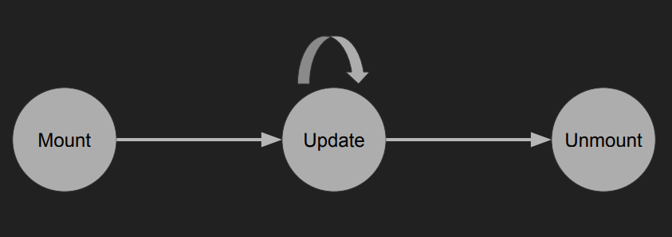

# Lecture 3 - React Native
React Native is a framework that relies on React core.

It allows us to build mobile apps using only JavaScript. The idea is to "Learn once, write anywhere".

Supports both iOS and Android.

## How does React Native work?
JavaScript is bundled. Transpiled and minified. This means that from a large project full of files it basically transpiles down into a small bundle.

This runs on your phone and there are separate threads for UI, Layout and JavaScript.

Those threads communicate asynchronously through a “bridge”:
- JS thread will request UI elements to be shown
- JS thread can be blocked and UI will still work

## Differences between React Native and React Web
- Base Components
- Style
- No browser API's
    * CSS animations, Canvas, SVG, etc.
    * Some have been polyfilled (fetch, timers, console, etc.)
- Navigation

## React Native Components
- Not globally in scope like React web components
    * `Import from 'react-native'`
- `div` -> `View`
- `span` -> `Text`
    * All text must be wrapped by a `<Text />` tag
- `button` -> `Button`
- `ScrollView`

More information https://reactnative.dev/docs/components-and-apis.html

### Style
React Native uses JS objects for styling. Object keys are based on CSS properties.

The default column layout is Flexbox layout. Lengths are in unitless numbers. Style prop can take an array of styles.

`StyleSheet.create()` - Functionally the same as creating objects for style, but has additional optimization: only sends IDs over the bridge.

### Event Handling
Unlike web, not every component has every interaction. Only a few “touchable” components:
- `Button`
- `TouchableOpacity`, `TouchableHighlight`, `TouchableWithoutFeedback`
- `TouchableNativeFeedback` (Android only)

Web handlers will receive the event as an argument, but React Native handlers often receive different arguments.

### Components
Return a node (something that can be rendered) which represents a discrete piece of the UI.

“All React components must act like pure functions with respect to their props.”

Two types:
- Stateless Functional Component (SFC) a.k.a. Pure Functional Component
- `React.Component`

#### Stateless Functional Component (SFC)
Simplest component: use when you don’t need state. A function that takes props and returns a node (Should be “pure” (it should not have any side effects like setting values, updating arrays, etc.)). Any change in props will cause the function to be re-invoked.

#### `React.Component`
An abstract class that can be extended to behave however you want. These have additional features that SFCs don’t:
- Have instances
- Maintain their own state
- Have lifecycle methods (similar to hooks or event handlers) that are automatically invoked

Rendering now becomes a function of props and class properties

### Component Lifecycle


#### Mount
- `constructor(props)` - Initialize state or other class properties (bound methods, etc.)
- `render()` - The meat of a component. Returns a node.
- `componentDidMount()` - Do anything that isn’t needed for UI (async actions, timers, etc.). Setting state here will cause a re-render before updating the UI.

#### Update
- `componentWillReceiveProps(nextProps)` - Update any state fields that rely on props
- `shouldComponentUpdate(nextProps, nextState)` - Compare changed values, return true if the component should rerender. If returned false, the update cycle terminates. Almost always a premature optimization.
- `render()`
- `componentDidUpdate(prevProps, prevState)` - Do anything that isn’t needed for UI (network requests, etc.).

#### Unmount
- `componentWillUnmount()` - Clean up. Remove event listeners. Invalidate network requests. Clear timeouts/intervals.

## Writing React Native
### Expo - "The fastest way to build an app”.
Suite of tools to accelerate the React Native development process.
- Snack - runs React Native in the browser
- XDE - a GUI to serve, share, and publish your Expo projects
- CLI - a command-line interface to serve, share, and publish projects
- Client - runs your projects on your phone while developing
- SDK - bundles and exposes cross-platform libraries and APIs

### Import/Export
Components are great for simplifying code. We can split components into their own files. This helps to organize the project and you can export the component from the file.

Import the component before using it in a file, where `Count` is default import and `{num}` is named import.
```javascript
import Count, {num} from './Count.js'
```

#### Default vs Named import/export
Example of Named export
```javascript
export const Count = props => (
    <Text style={styles.text}>{props.count}</Text>
)
```

Example of Default export
```javascript
export default props => (
    <Text style={styles.text}>{props.count}</Text>
)
```

or

```javascript
const Count = props => (
    <Text style={styles.text}>{props.count}</Text>
)

export default Count
```

### PropTypes
React can validate the types of component props at runtime. Development tool that allows developers to ensure they’re passing correct props. Helps document your components’ APIs. Only runs in development mode.

Example:
```javascript
import PropTypes from 'prop-types'

Count.propTypes = {
    count: PropTypes.number.isRequired
}
```

This will check if the Count prop contains number and will throw a warning if it does not.

You can also define PropTypes in a Class:
```javascript
import PropTypes from 'prop-types'

class Count extends React.Component {
    static propTypes = {
        count: PropTypes.number.isRequired
    }

    render() {
        return (
            <Text style={styles.text}>
                {this.props.count}
            </Text>
        )
    }
}
```